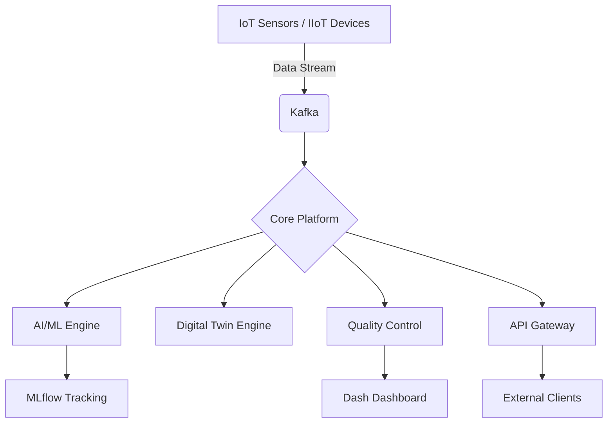

# IoT IIoT Intelligence Platform (IIIP) 🚀

[](https://www.python.org/)
[](https://opensource.org/licenses/MIT)
[](#)
[](https://www.docker.com/)

Интелигентна платформа за индустриален интернет на нещата (IIoT), изкуствен интелект (AI) и управление на жизнения цикъл на Industry 4.0/5.0 процеси.

---

## 📅 Последна актуализация: 22.01.2025 | Версия: 1.0.0

## 🔭 Визия
IIIP е цялостна екосистема, проектирана да обедини авангардни технологии в единна, мащабируема и високопроизводителна платформа. Тя обхваща всичко от сензорни данни в реално време и дигитални двойници до етичен изкуствен интелект, квантови симулации и блокчейн интеграция.

## 🏗 Архитектура


## 🛠 Технологичен стек

| Категория | Технологии |
|-----------|------------|
| **Език** |  |
| **Backend** |   |
| **ML & AI** |    |
| **Frontend** |   |
| **Infrastructure** |   |

## 📦 Основни Модули

Подробна документация за всеки модул можете да намерите в директория [Docs/](Docs/).

### 🧠 Изкуствен Интелект и ML
- **`automl_engine.py`**: Усъвършенстван AutoML енджин. [[Документация](Docs/AI_ML/automl_engine.md)]
- **`automated_ml_ops.py`**: Пълен MLOps жизнен цикъл. [[Документация](Docs/AI_ML/automated_ml_ops.md)]
- **`ai_ethics_monitor.py`**: Мониторинг на етиката в AI.

### 🏭 Индустриална Автоматизация
- **`automotive_quality_control.py`**: SPC контрол с X-bar и R карти. [[Документация](Docs/Industry_4_0/automotive_quality_control.md)]
- **`digital_twin_engine.py`**: Енджин за дигитални двойници.

### 🌐 Инфраструктура и Сигурност
- **`api_gateway_management.py`**: Асинхронен API Gateway. [[Документация](Docs/Infrastructure/api_gateway_management.md)]
- **`blockchain_integration.py`**: Блокчейн за IoT данни.

## 🐳 Контейнеризация (Docker)

Платформата е напълно контейнеризирана.

**Стартиране с Docker Compose:**
```bash
docker-compose up --build
```

## 🔧 Инсталация (Локално)

1. Клонирайте хранилището:
   ```bash
   git clone <repository-url>
   ```
2. Инсталирайте зависимостите:
   ```bash
   pip install -r requirements.txt
   ```
3. Изтеглете NLP моделите:
   ```bash
   python -m spacy download en_core_web_sm
   ```

## 🛡 Лиценз
Този проект е лицензиран под MIT Лиценз – вижте файла [LICENSE](LICENSE) за подробности.

---
© 2025 IoT IIoT Intelligence Platform Team.
