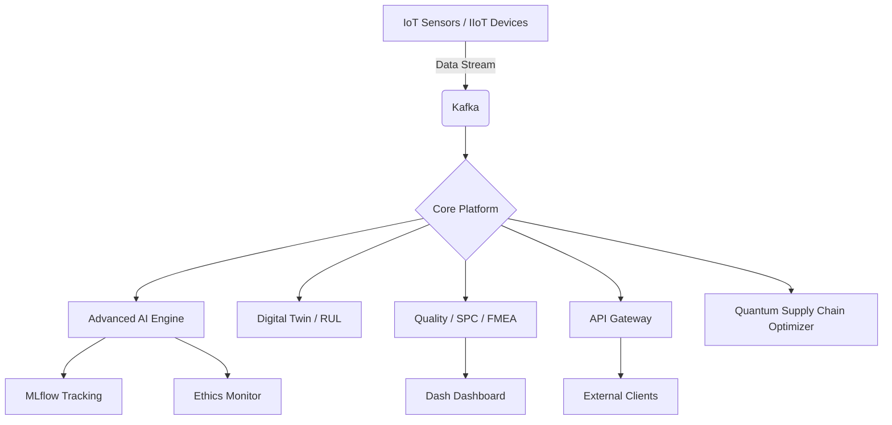

# IoT IIoT Intelligence Platform (IIIP) 🚀

[](https://www.python.org/)
[](LICENSE)
[](#)
[](https://www.docker.com/)
[](#)
[](#)
[](#)

Интелигентна платформа за индустриален интернет на нещата (IIoT), изкуствен интелект (AI) и управление на жизнения цикъл на Industry 4.0/5.0 процеси.

---

## 📅 Последна актуализация: Юли 2026 | Версия: 1.2.5 (Autonomous Fleet Management & Routing Engine Release)

## 🔭 Визия
IIIP е цялостна екосистема, проектирана да обедини авангардни технологии в единна, мащабируема и високопроизводителна платформа. Тя обхваща всичко от сензорни данни в реално време и дигитални двойници до етичен изкуствен интелект, квантови симулации, блокчейн интеграция и интелигентно управление на веригата за доставки.

## 🏗 Архитектура


## 🛠 Технологичен стек

| Категория | Технологии / Лого |
|-----------|------------------|
| **Език** |  |
| **Backend** |   |
| **ML, AI & Quantum** |     |
| **Frontend** |   |
| **Infrastructure** |   |

---

## ⚖️ Регулаторна съвместимост и стандарти

Платформата IIIP е разработена в съответствие с най-строгите световни стандарти и регулации в индустриалния и технологичния сектор:

*   **GDPR (Общ регламент относно защитата на данните)**: Пълно съответствие чрез вградената Zero-Trust сигурност, ролеви достъп (RBAC) и анонимизиране на лични данни.
*   **ISO/IEC 27001 (Управление на информационната сигурност)**: Прилагане на криптографски методи, одит логване с контролни суми (checksum) и сигурност на ниско ниво.
*   **Industry 5.0**: Проектиран с фокус върху сътрудничеството между хора и машини, устойчиво развитие (Scopes 1-3 за въглероден отпечатък) и висока гъвкавост.

---

## 📦 Основни Модули

Подробна документация и **Ръководства за потребителя** за всеки модул можете да намерите в директория [Docs/](Docs/).
Вижте основното [Глобално ръководство за потребителя](Docs/USER_MANUAL.md).

### 🧠 Изкуствен Интелект и ML
- **`advanced_analytics.py`**: PCA, клъстеризация и детекция на аномалии. [[Документация](Docs/AI_ML/advanced_analytics.md)]
- **`ai_ethics_monitor.py`**: Етичен надзор и анализ на пристрастия. [[Документация](Docs/AI_ML/ai_ethics_monitor.md)]
- **`automl_engine.py`**: Усъвършенстван AutoML енджин.
- **`automated_ml_ops.py`**: Пълен MLOps жизнен цикъл.
- **`quantum_computing.py`**: Математическо квантово симулиране за оптимизация на ресурси.

### 🏭 Индустриална Автоматизация (Industry 5.0)
- **`automotive_quality_control.py`**: SPC и FMEA анализ. [[Документация](Docs/Industry_4_0/automotive_quality_control.md)]
- **`digital_twin_engine.py`**: Дигитални двойници и RUL прогнози. [[Документация](Docs/Industry_4_0/digital_twin_engine.md)]
- **`cnc_ai_pipeline.py`**: Интелигентно управление на CNC.

### 🌐 Инфраструктура и Устойчивост
- **`api_gateway_management.py`**: Асинхронен API Gateway.
- **`sustainability_carbon_tracking.py`**: Проследяване на емисии (Scopes 1-3).

---

## 🐳 Контейнеризация (Docker)
```bash
docker-compose up --build
```

## 🛡 Лиценз
Платформата IIIP се разпространява под условията на MIT Лиценз – вижте [LICENSE](LICENSE) за подробности.

---
© 2026 IoT IIoT Intelligence Platform Team.
